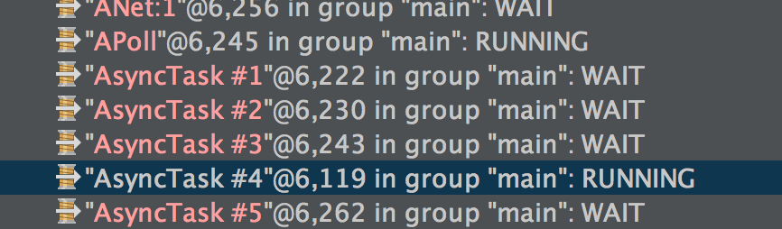
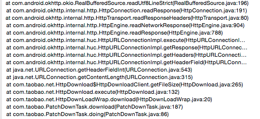

- 问题:
 
 测试同学说，日常环境下统一登录失败。

- 前期排查: 

1. 日常环境下统一登录失败，切换到预发和线上均没有问题。询问sdk接口人，没有出现类似情况。基本断定不是sdk的问题。
2. 日常环境下http请求会长时间无响应。基本断定跟登录是同一个问题。
3. 断掉wifi，重新链接，发现http请求和登录均恢复正常。

- 推测：
登录和http请求必然有某种联系，考虑到两者的请求都是异步的，并且都是基于AsyncTask的异步策略，而AsyncTask在3.0x以后默认是串行执行任务的，因此，极有可能是某个异步任务长时间阻塞，导致其他异步任务排队等候。

- 调试：

1. 查看线程堆栈,发现有一个可疑的asyncTask任务一直在跑:

2. 定位到具体代码:

发现是我们引入的一个二方库创建的asynctask，断点调试之，果然是这个库导致的。

修复起来就比较容易了。

- 总结：

 AsyncTask尽量不要做长时间异步操作，如果可以，尽量让AsyncTask并发执行，或者使用自己的线程池策略。